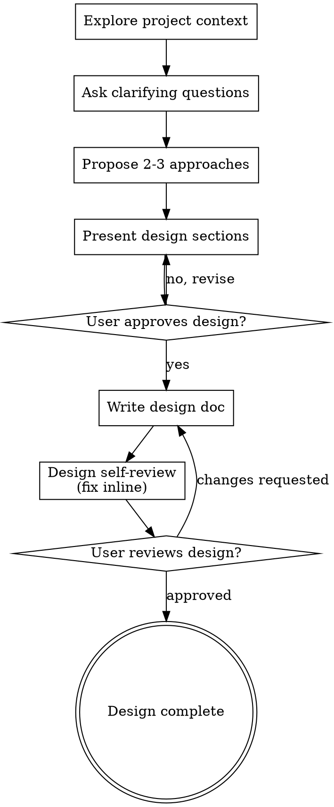

# Brainstorming Ideas Into Designs

Turn ideas into fully formed designs through natural collaborative dialogue.

Start by understanding the current project context, then ask questions one at a time to refine the idea. Once you understand what the user is building, present the design and get approval. The terminal product is a design document.

<HARD-GATE>
Do NOT invoke any implementation skill, write any code, scaffold any project, or take any implementation action until you have presented a design and the user has approved it. This applies to EVERY project regardless of perceived simplicity.
</HARD-GATE>

## Anti-Pattern: "This Is Too Simple To Need A Design"

Every project goes through this process. A todo list, a single-function utility, a config change — all of them. "Simple" projects are where unexamined assumptions cause the most wasted work. The design can be short (a few sentences for truly simple projects), but you MUST present it and get approval.

## Checklist

You MUST create a task for each of these items and complete them in order:

1. **Explore project context** — check files, docs, recent commits
2. **Ask clarifying questions** — one at a time, understand purpose/constraints/success criteria
3. **Propose 2-3 approaches** — with trade-offs and your recommendation
4. **Present design** — in sections scaled to their complexity, get user approval after each section
5. **Write design doc** — save the design document and commit
6. **Design self-review** — quick inline check for placeholders, contradictions, ambiguity, scope (see below)
7. **User reviews written design** — ask user to review the design file before proceeding

## Process Flow



**The terminal state is a committed design document.** What happens next with that document is up to the user and their workflow.

## The Process

### 1. Explore Project Context

Before asking any questions, understand the current state:

- Check files, docs, recent commits to understand the codebase
- Assess scope: if the request describes multiple independent subsystems, flag this immediately. Help the user decompose into sub-projects, each getting its own design cycle.

### 2. Ask Clarifying Questions

- Ask questions one at a time to refine the idea
- Prefer multiple choice questions when possible, but open-ended is fine too
- Only one question per message — if a topic needs more exploration, break it into multiple questions
- Focus on understanding: purpose, constraints, success criteria

### 3. Propose Approaches

- Propose 2-3 different approaches with trade-offs
- Present options conversationally with your recommendation and reasoning
- Lead with your recommended option and explain why

### 4. Present the Design

- Once you believe you understand what the user is building, present the design
- Scale each section to its complexity: a few sentences if straightforward, up to 200-300 words if nuanced
- Ask after each section whether it looks right so far
- Cover: context, goals/non-goals, key decisions, risks/trade-offs
- Be ready to go back and clarify if something doesn't make sense

**Design for isolation and clarity:**

- Break the system into smaller units that each have one clear purpose, communicate through well-defined interfaces, and can be understood and tested independently
- For each unit, you should be able to answer: what does it do, how do you use it, and what does it depend on?
- Can someone understand what a unit does without reading its internals? Can you change the internals without breaking consumers? If not, the boundaries need work.

**Working in existing codebases:**

- Explore the current structure before proposing changes. Follow existing patterns.
- Where existing code has problems that affect the work, include targeted improvements as part of the design.
- Don't propose unrelated refactoring. Stay focused on what serves the current goal.

### 5. Write the Design Document

After the design is approved through section-by-section review, write it to a file and commit.

**Output path:** Determine the appropriate path based on project context. Ask the user if unsure. The document MUST follow this structure:

```markdown
## Context

<!-- Background and current state. What exists today? What are the constraints? -->

## Goals / Non-Goals

**Goals:**
<!-- What this design aims to achieve -->

**Non-Goals:**
<!-- What is explicitly out of scope -->

## Decisions

<!-- Key design decisions and rationale -->
<!-- For each decision: what was chosen, why, and what alternatives were considered -->

## Risks / Trade-offs

<!-- Known risks and trade-offs -->
<!-- Format: [Risk] → Mitigation -->
```

Commit the design document to git.

### 6. Design Self-Review

After writing the design document, look at it with fresh eyes:

1. **Placeholder scan:** Any "TBD", "TODO", incomplete sections, or vague requirements? Fix them.
2. **Internal consistency:** Do any sections contradict each other? Does the architecture match the feature descriptions?
3. **Scope check:** Is this focused enough for a single implementation, or does it need decomposition?
4. **Ambiguity check:** Could any requirement be interpreted two different ways? If so, pick one and make it explicit.

Fix any issues inline. No need to re-review — just fix and move on.

### 7. User Review Gate

After the design review loop passes, ask the user to review the written design before proceeding:

> "Design written and committed to `<path>`. Please review it and let me know if you want to make any changes."

Wait for the user's response. If they request changes, make them and re-run the design review loop. Only proceed once the user approves.

## Red Flags: Excuses to Skip This Process

| Rationalization | Why It's Wrong |
|---|---|
| "This is just a simple question" | Even simple questions can lead to implementation. If it might lead to code, go through the process. |
| "Let me explore the codebase first" | Exploring is step 1 of the process. Start the checklist. |
| "The user already knows what they want" | Knowing what you want ≠ having a validated design. Assumptions hide in the gaps. |
| "I can design and implement at the same time" | No. Design decisions made during implementation are invisible and unreviewable. |
| "This is too small for a design" | Small changes cause big bugs when assumptions are wrong. The design can be short, but it must exist. |
| "I'll just make a quick fix first" | Fixes without design create technical debt. Design first, fix within the design. |

## Key Principles

- **One question at a time** — Don't overwhelm with multiple questions
- **Multiple choice preferred** — Easier to answer than open-ended when possible
- **YAGNI ruthlessly** — Remove unnecessary features from all designs
- **Explore alternatives** — Always propose 2-3 approaches before settling
- **Incremental validation** — Present design, get approval before moving on
- **Be flexible** — Go back and clarify when something doesn't make sense
- **Ground in reality** — Explore the actual codebase, don't just theorize
